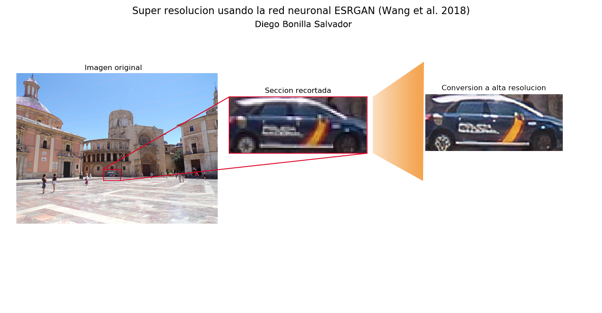

# Image-To-High-Resolution-With-Cycle-GAN
Image to high resolution using just one python library.

The amazing library from https://github.com/idealo/image-super-resolution implements various methods for inferencing super resolution from a low-res image.
Here I show my humble approach. Nothing fancy, just trying out the different models they've pretrained.
AMAZING!

